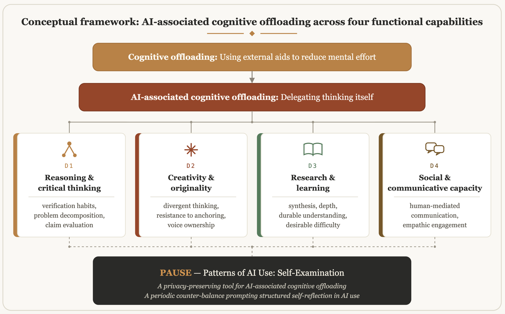
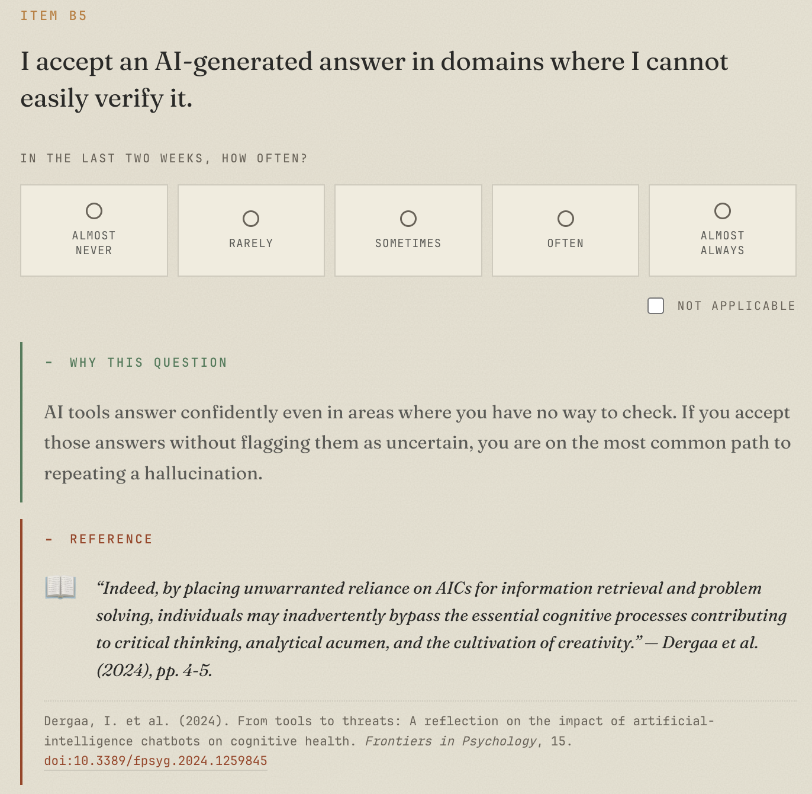
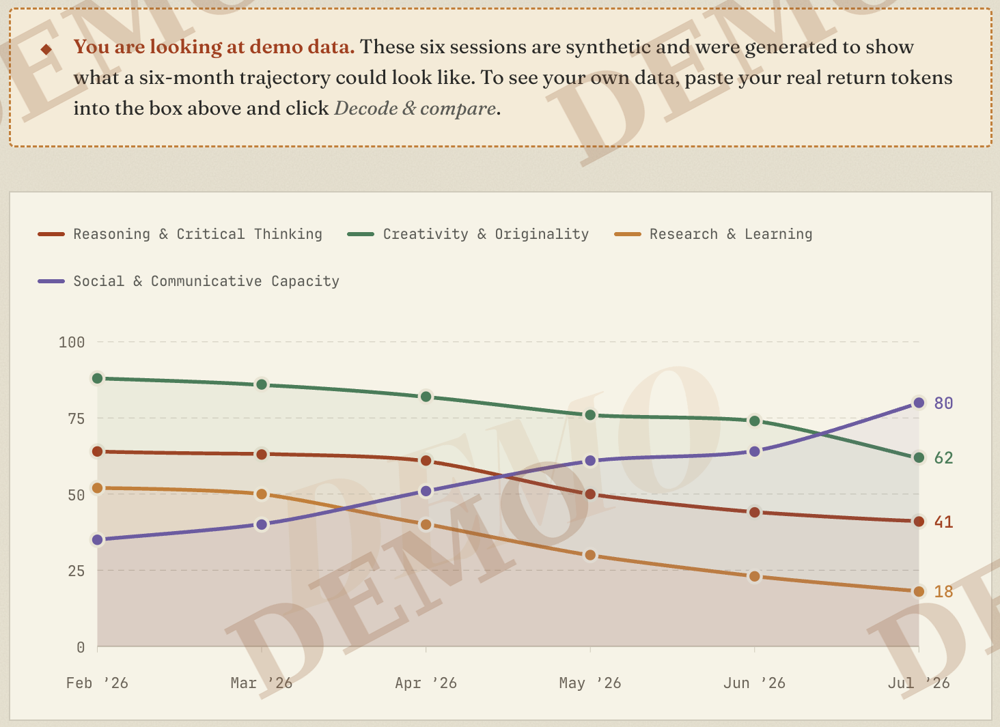
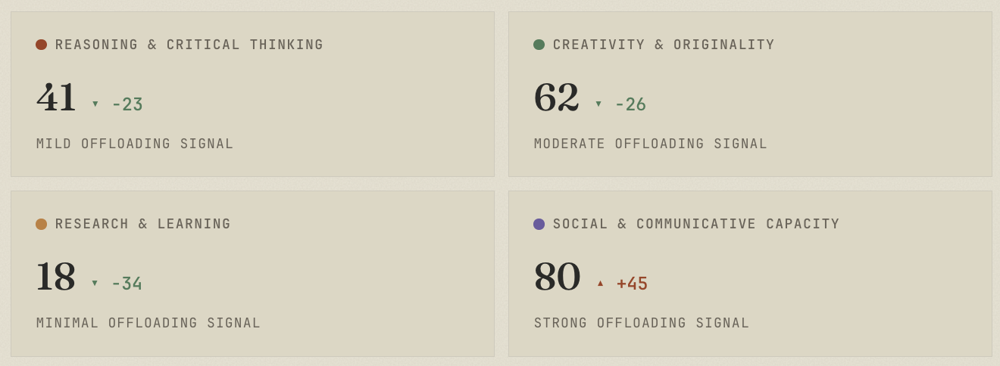

# PAUSE: Patterns of AI Use: Self-Examination

A free, anonymous, browser-based self-reflection tool for noticing how everyday AI use may be shaping your habits of thought, across four areas: *reasoning & critical thinking*, *creativity & originality*, *research & learning*, and *social & communicative capacity*.

**Live tool:** [anondo1969.github.io/pause](https://anondo1969.github.io/pause)

> **PAUSE is a self-reflection tool, not a validated psychological instrument.** It does not measure intelligence, ability, or mental health, and it presents no reliability or validity evidence. The readings it gives are descriptive self-reflection, not measurement. A high reading is not a verdict and a low one is not a clearance.



**Figure 1:** Conceptual framework: cognitive offloading across four functional capabilities. The four domains D1 through D4 map onto distinct strands of the 2023–2026 empirical literature and feed into the self-check.

## What it is, technically

A static site: plain HTML, CSS, and JavaScript, with no backend, no build step, no framework, and no third-party scripts. Everything happens in the browser:

- No account, no login, no upload.
- All scoring runs client-side. Nothing you answer is transmitted anywhere or persisted beyond the browser session.
- No tracking cookies, no analytics, and no third-party requests of any kind: even the fonts are self-hosted (SIL Open Font License, in `fonts/`).
- No LLM is involved anywhere in the running tool: a tool for reflecting on cognitive offloading should not itself offload.

The only optional persistence is a **return token**: a short opaque string you copy and keep yourself, encoding your four readings so you can paste it back later on the Compare page to see how things have shifted. It is decoded entirely in the browser and never sent to a server.

## Architecture

The codebase enforces a strict separation of concerns:

| Layer | Where | Rule |
|---|---|---|
| **Data** | `data/` | Every text the site displays (page copy, quiz strings, questions, feedback) lives in JSON or Markdown. Editing wording never touches HTML or JS. |
| **Logic** | `js/` | Execution only. Scripts read strings from `data/` and assign CSS classes; they contain no copy and no styling. |
| **Design** | `css/style.css` | All visual design, including fonts, the chart palette, and every style that was once inline. HTML and JS contain no design. |
| **Structure** | `index.html`, `pages/` | Empty backbones. Each page is a small skeleton with a `data-page` attribute; `js/app.js` injects the shared chrome (banner, navigation, footer) and renders the page content from its data file. |

The shared chrome is defined **once** in `data/site.json` and injected by `js/app.js` on every page, so there is no repeated banner, navigation, or footer markup anywhere.

Long-form documents (the essay, the paper, the privacy explainer) are Markdown files rendered at runtime by `js/markdown.js`, a small in-house renderer written so the "no third-party scripts" promise stays true.

## Project structure

```
.
├── index.html                      Landing page (root, as GitHub Pages expects)
├── favicon.svg
├── README.md
├── PAUSE-paper-Mahbub-Ul-Alam.pdf  The typeset manuscript (downloadable PDF)
├── LICENSE                         MIT (the software)
├── LICENSE-CONTENT.md              CC-BY instrument, CC-BY-SA manuscript, OFL fonts
├── Dockerfile                      Optional self-hosting as a static nginx image
│
├── media/                          Images used by the README and the article/paper
│   ├── figure1-theoretical-framework.png
│   ├── item-b5-anatomy.png
│   ├── compare-chart.png
│   ├── compare-deltas.png
│   ├── offloading-pattern-demo.png
│   └── compare-demo.png
│
│
├── pages/                          All other page backbones
│   ├── quiz.html                   The self-check
│   ├── compare.html                Paste return tokens to see change over time
│   ├── about.html                  What it is, the design, the stance
│   ├── essay.html                  Why it exists (rendered from Markdown)
│   ├── paper.html                  The full manuscript (rendered from Markdown)
│   ├── privacy.html                Privacy notice in plain language
│   └── privacy-explained.html      The reasoning behind the privacy design
│
├── css/
│   └── style.css                   ALL design: theme, layout, fonts, chart palette
│
├── js/
│   ├── app.js                      Shared page engine: chrome injection + data-driven
│   │                               page rendering; exposes PAUSE_APP.ready
│   ├── markdown.js                 Minimal Markdown → HTML renderer (no dependencies)
│   ├── scoring.js                  Pure scoring functions (no DOM, no network)
│   ├── quiz.js                     Self-check state machine (logic only)
│   └── compare.js                  Token decoding, trajectory chart, analysis (logic only)
│
├── fonts/                          Self-hosted typefaces (SIL Open Font License)
│   ├── Fraunces-Roman-VF.woff2     Variable fonts served from this origin, so no
│   ├── Fraunces-Italic-VF.woff2    visitor request ever reaches a third party
│   ├── JetBrainsMono-*.woff2
│   └── OFL-*.txt                   The required licence texts
│
├── tests/                          Verification suite (see Testing below)
│   ├── audit.js                    Asserts the paper's checkable claims
│   ├── smoke.js                    Boots all pages in a simulated browser
│   ├── smoke_full_quiz.js          Drives the self-check end to end
│   ├── smoke_hash.js               Token-via-URL comparison flow
│   └── README.md                   How to run everything
│
└── data/
    ├── site.json                   Shared chrome: banner, nav, footer, citation
    ├── pages/                      Per-page content and interface strings
    │   ├── index.json              Landing page copy (hero, sections, cards, CTA)
    │   ├── about.json              About page copy
    │   ├── privacy.json            Privacy page copy
    │   ├── quiz.json               Every string the self-check displays
    │   ├── compare.json            Every string the Compare page displays
    │   ├── essay.json              → points at content/essay.md
    │   ├── paper.json              → points at content/paper.md
    │   └── privacy-explained.json  → points at content/privacy-explained.md
    ├── content/                    Long-form documents, rendered at runtime
    │   ├── essay.md
    │   ├── paper.md
    │   └── privacy-explained.md
    └── instrument/                 The instrument itself
        ├── items.json              Context block, trajectory block, four domains
        ├── b7_pool.json            Reasoning-probe pool (claim-evaluation items)
        ├── c7_dictionaries.json    Creativity-probe objects and scoring dictionaries
        └── feedback.json           Domain- and role-branched practice suggestions
```

## Editing content

Because all texts are data, common edits never touch code:

- **Change any page copy** → edit the matching file in `data/pages/`.
- **Change the essay, paper, or privacy explainer** → edit the Markdown in `data/content/`.
- **Change a question, scale, or citation** → edit `data/instrument/items.json`.
- **Change a practice suggestion** → edit `data/instrument/feedback.json`.
- **Change the banner, navigation, footer, or citation** → edit `data/site.json` (applies to every page at once).
- **Change colors, spacing, or typography** → edit `css/style.css`.

## Run it locally

The pages load their data with `fetch()`, which browsers block on `file://` URLs. Serve the folder with any static server:

```bash
git clone https://github.com/anondo1969/pause.git
cd pause
python -m http.server 8000
# open http://localhost:8000
```

Any static file server works (`npx serve`, nginx, etc.). There is nothing to build or install.

## Deploy on GitHub Pages

The repository is deployable as-is: `index.html` sits at the root, and every internal path is relative (pages under `pages/` use a `<base href="../">` tag, so all assets resolve from the repository root). Enable GitHub Pages on the main branch and the site is live.

## How the pieces fit at runtime

1. Each HTML backbone declares its identity: `<body data-page="quiz">`.
2. `js/app.js` fetches `data/site.json` and `data/pages/<page>.json`, sets the title and meta description, injects the banner(s), navigation, and footer, and renders the page content: declarative blocks for content pages, or a Markdown document for the long-form pages.
3. Interactive pages (`quiz.js`, `compare.js`) wait on `PAUSE_APP.ready`, receive their strings from the page data, then run. The quiz additionally fetches the four instrument files from `data/instrument/`.
4. All scoring calls go through `js/scoring.js`, a pure module with no DOM and no network access, so every scoring rule is a single inspectable file.

## Testing

The `tests/` directory contains a reproducible verification suite that runs
against the production code in this repository, not against mocks. `audit.js`
asserts the paper's mechanically checkable claims: the Appendix C worked
example (the D1 reading of 71 and the brick Alternative Uses example landing
on band 1 with its exact categories), the Appendix B band rubric, the
cross-session probe-rotation guarantee over 2,000 draws, return-token
round-trip and malformed-token rejection, HTML escaping, WCAG 2.1 AA
contrast computed from the deployed palette, and the absence of third-party
requests. The three smoke scripts boot every page, drive the complete
self-check to the result page (including the probe skip paths), and verify
the token-via-URL comparison flow, all in a simulated browser.

```bash
cd tests
npm install          # jsdom is the only dependency
npm run all          # every check; non-zero exit on any failure
```

The running site itself needs none of this: the suite is a development
dependency only, and the tool remains plain HTML, CSS, and JavaScript with
no build step. See `tests/README.md` for per-script details and CI usage.

## Privacy design

There is no backend. The application transmits nothing, stores nothing server-side, sets no tracking cookies, and runs no analytics. Session storage is used only for in-tab progress and probe-rotation hints, and clears when the tab closes. The full reasoning is on the [privacy page](https://anondo1969.github.io/pause/pages/privacy.html) and in [privacy, explained](https://anondo1969.github.io/pause/pages/privacy-explained.html).

## Example Images



**Figure 2:** What *citation-grounded* means, shown on item B5 as rendered by the deployed tool. Every scored item has the same three-part anatomy: the behavioural task with its response scale and a *Not applicable* option; an expandable *Why this question* panel giving the item’s rationale in plain language; and an expandable *Reference* panel containing an exact quote from the anchoring study above the full citation with a resolvable DOI. Both panels can be opened before answering, so the respondent can always inspect the evidence behind a question rather than take the item on trust.



**Figure 3a:** The trajectory chart: one smoothed line per domain over six monthly sessions, with final readings labelled at the line ends. The diagonal watermark marks the data as synthetic even in a cropped screenshot.



**Figure 3b:** Per-domain delta cards: the latest reading, the last-minus-first change on the 0 to 100 scale, and the descriptive band of the latest session.

**Figure 3:** The Compare view rendering the synthetic six-month demo trajectory, shown top to bottom as the respondent sees it. Everything in all these panels is computed in the browser from the pasted return tokens alone; no token is transmitted, stored, or linked to any identity.

## License

- **Code:** MIT
- **Instrument items and scoring rubric:** CC-BY 4.0
- **Manuscript:** CC-BY-SA 4.0

## Citation

```bibtex
@misc{alam2026pause,
      title={PAUSE: A Privacy-Preserving Self-Reflection Tool for AI-Associated Cognitive Offloading}, 
      author={Mahbub Ul Alam},
      year={2026},
      eprint={xxxx.xxxxx},
      archivePrefix={arXiv},
      primaryClass={cs.HC},
      url={https://arxiv.org/abs/xxxx.xxxxx},
	    doi={10.48550/arXiv.2407.10777},
	    note={\href{https://doi.org/10.48550/arXiv.xxxx.xxxxx}{doi:10.48550/arXiv.xxxx.xxxxx}}
}
```

## Contact

Questions, collaboration, translation offers, or item-comprehension issues: open an issue on this repository.

You can also reach me directly by email at <a href=\"mailto:mahbub.ul.alam.anondo@gmail.com\">mahbub.ul.alam.anondo@gmail.com</a> or on <a href=\"https://www.linkedin.com/in/anondo\" target=\"_blank\" rel=\"noopener\">LinkedIn</a>.